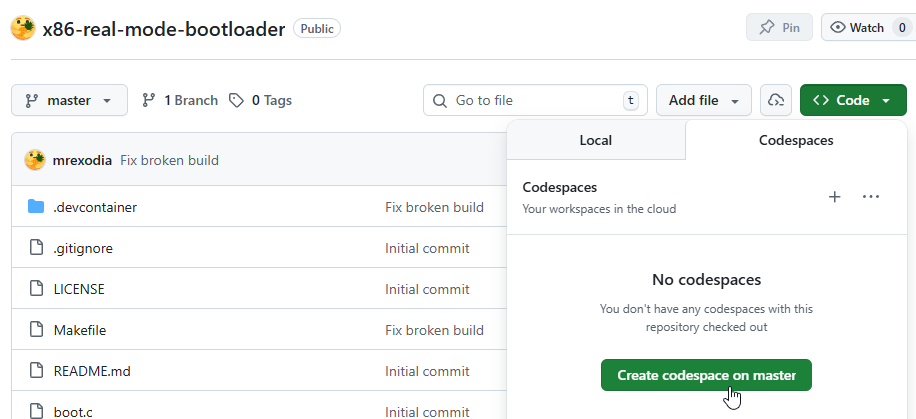

# x86 real mode bootloader


This is a bootloader for x86 real mode, written using [`gcc-ia16`](https://github.com/tkchia/gcc-ia16).

The bootloader parses the FAT16 filesystem, searches the root directory for `IO.SYS`, loads it at address 0x0700, and transfers control to it. If `IO.SYS` is not found, it prints "N" and halts.

**Note**: Originally the idea was to support booting DOS, but that requires more work (see links section).

There are various similar project out there, my contributions:
- Emit actual 16-bit real mode code from C. Projects often emit 32-bit protected mode code with the `0x66` prefix (`-m16` and/or `asm(".code16gcc");`).
- This project was fully created in a [Devcontainer](https://containers.dev/), giving you an easy-to-reproduce environment.
- The produced image is also valid FAT16, which means you don't need an MBR to boot it.
- Working gdb setup scripts for use with qemu to debug your bootloader.

## Setting up the environment

This repository uses a [`devcontainer.json`](./.devcontainer/devcontainer.json) file to allow you to quickly get started.

### GitHub Codespaces

1. [Fork this repository](https://github.com/mrexodia/x86-real-mode-bootloader/fork)
2. Click the green `<> Code` button
3. Press `Codespaces`
4. Press `Create codespace on master`
6. Wait a minutes while the image is loading ☕
   - Press `Show log` to see progress
   - Reload the page if it appears stuck
   - **If Firefox does not work, try Chrome!**



### Visual Studio Code + Docker

Alternatively you can install [Docker Desktop](https://www.docker.com/products/docker-desktop/) and use the Visual Studio Code [Dev Containers](https://code.visualstudio.com/docs/devcontainers/tutorial) extension to run the project.

**Note**: You need to disable git's `core.autocrlf` option for this to work:

```sh
git config --global core.crlf false
```

## Project Structure

- `boot.c` - Main bootloader (loaded at 0x7C00)
- `io.c` - Sample IO.SYS implementation (loaded at 0x0700)
- `boot.ld` - Linker script for boot sector (max 510 bytes)
- `io.ld` - Linker script for IO.SYS (max 3 sectors)
- `i8086.xml`, [`i386-32bit.xml`](https://github.com/qemu/qemu/blob/master/gdb-xml/i386-32bit.xml) - GDB architecture definitions for 16-bit debugging
- `real-mode.gdb` - GDB script for debugging real mode code
- `emulator.py` - Python emulator using unicorn for step-by-step tracing

## Prerequisites

See the [`Dockerfile`](.devcontainer/Dockerfile) for installation instructions on Ubuntu 24.04, other platforms might work but were not tested.

- mtools
- qemu
- gdb
- gcc-ia16

## Compilation

Build the bootloader and disk image:

```sh
make
```

Run in qemu (`-nographic`):

```sh
make run
```

Press `Ctrl+A` and `X` to quit the TUI.

Other targets:

```sh
make rebuild    # Clean and rebuild
make disasm     # Disassemble boot.elf
make dostest.img # Create test image with DOS files (not shipped)
```

## Python Emulator

This project includes a Python-based emulator using [Unicorn Engine](https://www.unicorn-engine.org/) and [Capstone](https://www.capstone-engine.org/) that provides step-by-step instruction tracing with BIOS interrupt emulation:

```sh
# Install dependencies
pip install unicorn capstone

# Run emulator with disk image
python3 emulator.py boot.img
```

## Debugging

```sh
make debug
```

Qemu will wait for you to attach a debugger:

```sh
gdb -x real-mode.gdb
```

You will have to press enter for confirmation and then you should see:

```sh
Breakpoint 1 at 0x7c00
AX:AA55 BX:0000 CX:0000 DX:0080
SI:0000 DI:0000 BP:0000 SP:6F08
CS:0000 DS:0000 SS:0000 ES:0000
IP:7C00 FLAGS:0202
=> 0x7c00:      jmp    0x7caa

Breakpoint 1, 0x00007c00 in ?? ()
(gdb)
```

## Links

- [Bootable 16bit C program with gcc-ia16](https://gist.github.com/jtsiomb/ff4c13e353b568599cddbecaf403ecd3)
- [luke8086/boot2c](https://github.com/luke8086/boot2c)
- [General BIOS (legacy) boot process](https://github.com/pts/bakefat/blob/master/boot_process.md)
- [lDOS boot documentation](https://pushbx.org/ecm/doc/ldosboot.htm)
- [kjiwa/x86-boot-sector-c](https://github.com/kjiwa/x86-boot-sector-c)
- [queso-fuego/c-realmode-example](https://github.com/queso-fuego/c-realmode-example)
